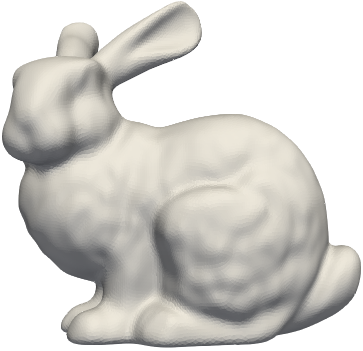
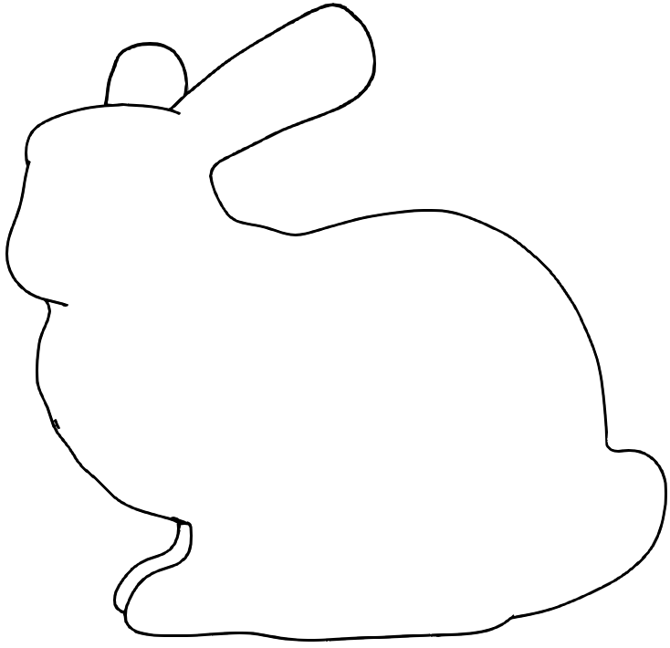
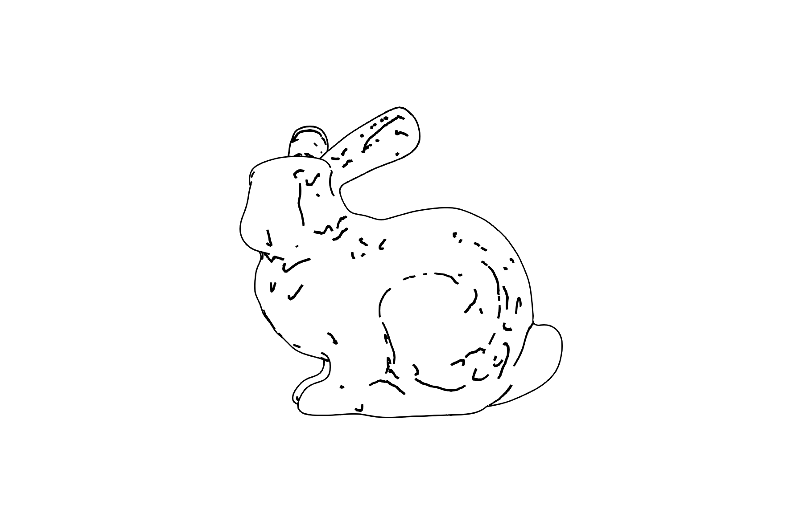
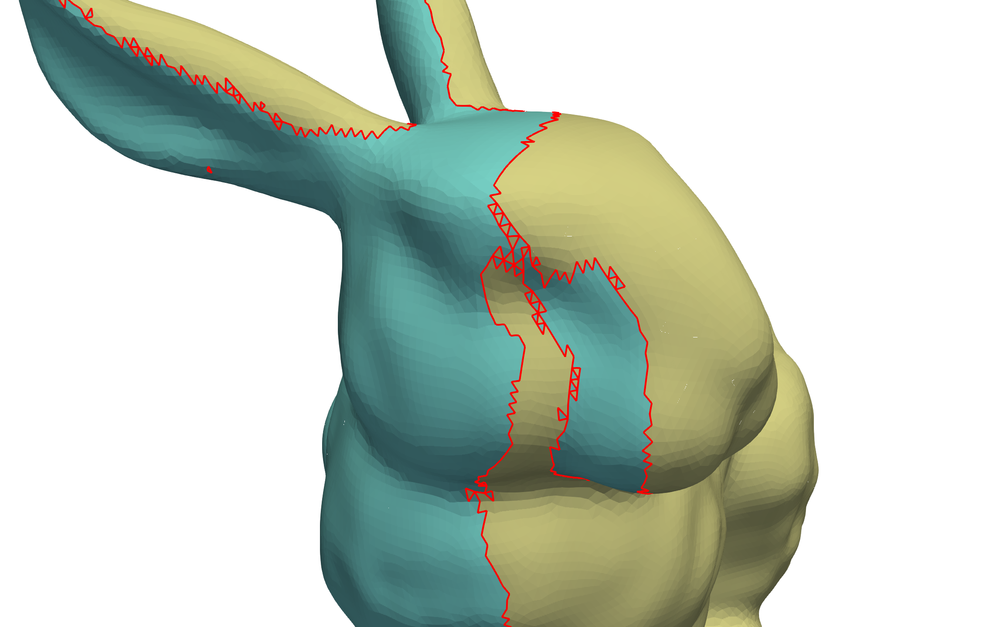
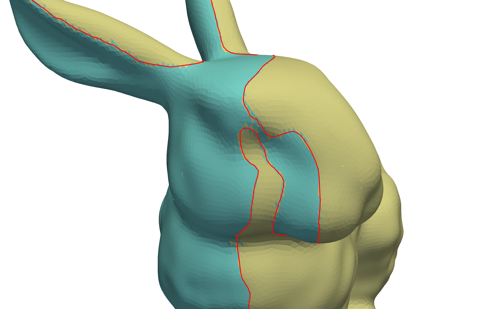

# Suggestive Contour

非写実的レンダリング (NPR: Non-Photorealistic Rendering) における代表的な輪郭線の生成手法である Suggestive Contours for Conveying Shape [DeCarlo et al 2003] の実装．図は左から入力メッシュ，輪郭線，輪郭線とsuggestive contour．

### 1. 輪郭線
NPRとは，人間が描くような画風の特徴を持つ画像を生成する技術である．セル画やテクニカルイラストレーション，筆絵など様々な画風において輪郭線は重要な要素であるため，3次元形状のNPRにおいて輪郭線を計算することは基本的なステップとなる場合が多い．

3次元形状に対する輪郭線は，ある視点に対して，視点方向を向いている領域と向いていない領域の境界となる曲線である．言い換えると，曲面上のある点 $ \bm{p} $ ，その法線ベクトル $ \bm{n} $ ，視点位置 $\bm{c}$ に対して，視線ベクトル$(\bm{c}-\bm{p})$と法線ベクトル$\bm{n}$が直交する，つまり，$(\bm{c}-\bm{p})\cdot\bm{n}=0$となる等値線である．三角形メッシュの場合，輪郭線は視点方向を向いている面と向いていない面が共有する辺の集合となる．視点方向を向いている面は面上の任意の点と面法線について$(\bm{c}-\bm{p})\cdot\bm{n}>0$となる面であり，全ての面に対して内積の正負を調べることでメッシュの輪郭線を計算することができる．

メッシュの辺に沿って輪郭線を描画する手法は頑健で効率的だが，複雑な位相を生み出し多くのノイズが発生してしまう．  
  
これは筆絵のような特徴を曲線に持たせる場合やアニメーションの際に不都合となる．各三角形内で線形補間をすることにより，滑らかな輪郭線を描画することができる．まず，与えられた視点位置$\bm{c}$と頂点$i$に対して次の関数を定義する．
$$
g(\bm{p}_i) = (\bm{c} - \bm{p}_i) \cdot \bm{n}_i
$$
$g(\bm{p}_i)>0$のとき頂点$i$は視点方向を向いている．次に三角形内で$g(\bm{p})$を線形補間する．これにより関数$g(\bm{p})$を区分線形関数として曲面全体に定義することができる．三角形の二つの頂点に対する関数値の符号が反対となるとき，輪郭線は線分として三角形の内部を通る．頂点$i, j$間の辺上の線形補間は
$$
g(t) = (1-t) g(\bm{p}_i) + t g(\bm{p}_j)
$$
である．$g(t)=0$を解くと，
$$
t = \frac{g(\bm{p}_i)}{g(\bm{p}_i) - g(\bm{p}_j)},\\
\bm{p}(t) = (1-t) \bm{p}_i + t \bm{p}_j 
= \frac{g(\bm{p}_i)\bm{p}_j - g(\bm{p}_j)\bm{p}_i}{g(\bm{p}_i) - g(\bm{p}_j)}
$$
となり，輪郭線の線分の端点を得ることができる．  
  
線形補間により滑らかな線が得られるが，これはメッシュそのものに対する輪郭線ではなく，線が三角形の内部を通るため，面が視点方向を向いていない場合に視点から見えなくなるという問題点がある．

### 2. Suggestive Contour
輪郭線は3次元形状のNPRにおいて重要な要素であると述べたが，輪郭線のみで形状の際立った特徴を表現することは難しく，多くの場面で追加の線を必要とする．稜線や谷線は物体の構造や複雑さを表現することができる特徴線の一例であるが，視点依存性がなく曲面上に固定されているため，過剰にくっきりとした線を描画する傾向がある．DeCarloらは，視点に依存する特徴線であるsuggestive contourを提案した．suggestive contourはほとんど輪郭線となる，つまり，元の視点からは輪郭線でないが，少し移動した近くの視点からは輪郭線となるような部分を描画する線である．

suggestive contourの定義には曲率を用いる．曲線上の点$\bm{p}$の曲率$\kappa(\bm{p})$は，$\bm{p}$での曲線を最も良く近似する円の半径の逆数である．$\kappa(\bm{p})>0$のとき，一般的に円は曲線の下にあり曲線は凸状になると定義され，$\kappa(\bm{p})=0$は直線または変曲点に対応する．
曲面上の点$\bm{p}$での曲率は，曲面に沿って$\bm{p}$を通る任意の曲線によって定義される．$\bm{p}$を通り法線ベクトル$\bm{n}$を含む平面と，曲面の交差部分（平面曲線）の曲率を法曲率と呼ぶ．法曲率の最大値と最小値を主曲率と呼び，それらに対応するベクトルを主方向と呼ぶ．suggestive contourでは，視点位置の情報を含んだ曲率であるラジアル曲率$\kappa_r$を考える．$\kappa_r$は，点$\bm{p}$から視点方向へのベクトルを$\bm{p}$での接平面上に射影したベクトル$\bm{w}$を用いて，$\bm{w}$方向の法曲率として定義する．

ラジアル曲率は$\bm{n}$と$\bm{w}$を含む平面と曲面の交差部分が作る平面曲線の曲率と言える．suggestive contourはこのような曲線の変曲点となり，かつラジアル曲率が$\bm{w}$方向に向かって増加する点の集合である．したがって次のように定義できる．
$$
\kappa_r = 0 \ \mathrm{and} \ \nabla_{\bm{w}}\kappa_r>0
$$
ここで$\nabla_{\bm{w}}\kappa_r$は，$\kappa_r$のベクトル$\bm{w}$に沿った方向微分である．

三角形メッシュに対しては線形補間を用いて線を描画する．まず，各頂点に対して$\kappa_r$の値を計算する．これは微分幾何学におけるオイラーの定理により求められる．
$$
\kappa_r(\bm{p}) = \kappa_1(\bm{p}) \cos^2\phi + \kappa_2(\bm{p}) \sin^2\phi
$$
ここで$\kappa_1, \kappa_2$はそれぞれ最大，最小の主曲率であり，$\phi$は$\bm{w}(\bm{p})$と$\kappa_1$に対応する主方向との角度である．次に三角形内で$\kappa_r$を線形補間し，その零点を見つける．その後，得られた線分の集合に対して$\nabla_{\bm{w}}\kappa_r>0$の判定をする．これは，三角形内で$\kappa_r$の勾配ベクトル計算し，頂点で平均化することで計算できる．
